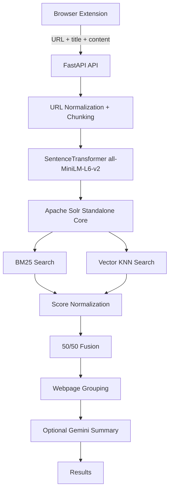

# MemoryLane

Personal browsing-memory retrieval: save pages you visit, then search them with hybrid BM25 + dense-vector ranking on Apache Solr 9.x. FastAPI serves indexing and search; Gemini is optional for summaries.

## 1. Overview

MemoryLane stores readable webpage text as overlapping-size chunks, embeds each chunk with `all-MiniLM-L6-v2` (384 dimensions), and indexes both lexical fields and vectors in a Solr standalone core named `memorylane`. Search fuses BM25 and KNN scores, groups hits by webpage, and can summarize the winning page with Gemini.

## 2. Architecture



## 3. Prerequisites

- **Python 3.10+**
- **Apache Solr 9.x** (DenseVectorField is not available in Solr 8). Target version: **9.7.0**.
- Optional: **Google Gemini API key** for summaries
- Chrome/Chromium for the Manifest V3 extension
- Docker (optional) if you prefer Compose instead of a local Solr install

## 4. Installation

```bash
cd memorylane
python -m venv .venv
# Windows: .venv\Scripts\activate
# Unix:    source .venv/bin/activate
pip install -r requirements.txt
copy .env.example .env   # Windows
# cp .env.example .env   # Unix
```

The first embedding call downloads `all-MiniLM-L6-v2` from Hugging Face.

## 5. Configuration

Copy `.env.example` to `.env`. Variables:

| Variable | Default | Purpose |
|---|---|---|
| `SOLR_URL` | `http://localhost:8983/solr/memorylane` | Core URL |
| `DEFAULT_TOP_K` | `5` | Grouped results to return |
| `DEFAULT_CANDIDATE_POOL` | `30` | BM25 and KNN candidate size |
| `BM25_WEIGHT` / `VECTOR_WEIGHT` | `0.5` / `0.5` | Fusion weights |
| `TARGET_MIN_WORDS` / `TARGET_MAX_WORDS` | `300` / `500` | Chunk size |
| `EMBEDDING_MODEL` | `all-MiniLM-L6-v2` | SentenceTransformer name |
| `EMBEDDING_DIM` | `384` | Must match Solr `DenseVectorField` |
| `GEMINI_API_KEY` | empty | Leave empty to disable summaries |
| `GEMINI_MODEL` | `gemini-2.0-flash` | Gemini model id |
| `API_HOST` / `API_PORT` | `0.0.0.0` / `8000` | Uvicorn bind |

## 6. Solr setup

Start Solr 9.x (local install or Docker). Then install the `memorylane` core and schema:

```bash
# Unix
./scripts/setup_solr.sh

# Windows PowerShell
.\scripts\setup_solr.ps1

# Destructive recreate
./scripts/setup_solr.sh --reset
.\scripts\setup_solr.ps1 -Reset
```

The script is idempotent: it checks Solr is up, requires version 9+, creates the core if missing, applies the schema via the Schema API, reloads, then verifies ping, indexing, BM25, and KNN. Paths are resolved from the script location.

Canonical field definitions live in `solr/schema.xml` (`id`, `webpage_id`, `url`, `domain`, `title`, `text`, `chunk_id`, `total_chunks`, `timestamp` as string, `embedding` cosine 384-d). `text_general` uses BM25 similarity.

## 7. Running the API

From the project root (so `backend` is importable):

```bash
uvicorn backend.main:app --reload --host 0.0.0.0 --port 8000
```

Health:

```bash
curl http://localhost:8000/health
```

Returns Solr, embedding-model, and Gemini status. Overall `status` is `ok` when Solr and the embedding model are ready; Gemini is optional.

## 8. Indexing (`POST /memory`)

Body: `{ "url", "title", "content" }`.

Pipeline: normalize URL → `webpage_id` → paragraph/sentence chunking → embeddings → delete existing chunks for that `webpage_id` → index `{webpage_id}::chunk::{n}`. Re-saving the same URL replaces chunks instead of duplicating them.

## 9. Search (`POST /search`)

Body: `{ "query", "num_results": 5, "summarize": true, "debug": false }`.

Uses the same hybrid pipeline as the CLI. Set `debug` to include normalized BM25, vector, and fused scores.

## 10. Hybrid retrieval and fusion

1. BM25 on `text` and `title^2` (edismax)
2. Query embedding
3. Solr `{!knn f=embedding topK=...}`
4. Min-max normalize each list (empty → {}; identical or single scores → 1.0)
5. Fuse: `0.5 * bm25_norm + 0.5 * vector_norm` (missing method → 0.0)
6. Group by `webpage_id` (highest chunk score wins)
7. Return top-K pages

## 11. URL normalization

Lowercase scheme/host, strip `www.`, drop fragments, drop trailing slashes (except `/`), strip `utm_*`, `fbclid`, `gclid`, `ref`, `ref_src`, sort remaining query params. `webpage_id` is a Solr-safe `domain_path` string with a hash suffix when too long.

## 12. Chunking and embeddings

Paragraphs accumulate toward 300–500 words. Oversized paragraphs split on sentences, then hard-split by word count. Tiny trailing chunks merge into the previous chunk. Embeddings are L2-normalized 384-d vectors; dimension mismatches raise an error.

## 13. Gemini summarization

If `GEMINI_API_KEY` is set, search asks Gemini to summarize **only** the stored page text. Query wording selects SHORT (`brief`, `tl;dr`, …), LONG (`detailed`, `in-depth`, …), or MEDIUM. Failures return `summary: null` without breaking search.

## 14. CLI

```bash
python -m backend.cli "your query" --top-k 5 --candidates 30 --debug --no-summarize
```

## 15. Browser extension

Load unpacked from `extension/` in `chrome://extensions` (Developer mode).

- **Remember this page** — content script extracts readable text (scripts, styles, nav noise removed); background worker posts to `/memory`.
- **Search** — popup posts to `/search` and lists titles, domains, dates, and summaries.

The API must be at `http://localhost:8000`.

## 16. Evaluation

Sample queries: `evaluation/evaluation.json`.

```bash
python -m evaluation.generate_eval   # build queries from indexed pages
python -m evaluation.evaluate        # Recall@1/3/5/10 and MRR
```

Metrics use the production `hybrid_search` path. Relevant URLs are compared after normalization.

## 17. Tests

```bash
pytest tests/ -v
```

Unit tests cover URL ids, chunking edge cases, score fusion/grouping, and API contracts (including Gemini-off summaries). They do not require a live Solr instance.

## 18. Docker Compose

```bash
docker compose up -d
.\scripts\setup_solr.ps1
```

`docker-compose.yml` runs Solr **9.7** and precreates the `memorylane` core. You still need `setup_solr` so DenseVectorField and custom fields exist.

---

### Manual verification

1. Start Solr 9.x → `setup_solr.ps1` / `setup_solr.sh` → core healthy
2. Start FastAPI → `GET /health`
3. `POST /memory` → documents in Solr
4. `POST /search` → hybrid results
5. Re-index the same URL → chunk count stable, no duplicates
6. Semantic query using different wording than the page
7. Gemini key set → summaries present
8. Load the extension → save and search
